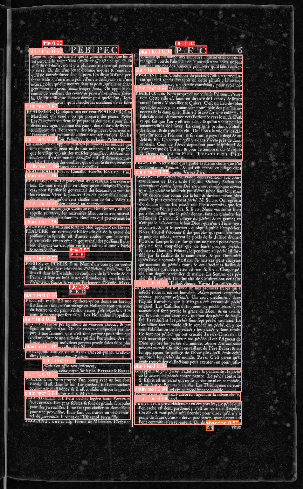

# Layout & Text Recognition


This repository contains code and resources for layout analysis and text recognition tasks. It includes the combination of DocLayout-YOLO and Tesseract OCR to detect and recognize text in images, as well as scripts for preprocessing and postprocessing the data.


## DocLayout-YOLO Model

DocLayout-YOLO is a deep learning model designed for document layout analysis. It is based on the YOLO architecture and has been fine-tuned on a synthetic dataset for detecting various layout elements in documents. https://github.com/opendatalab/DocLayout-YOLO

The model weights can be downloaded from HuggingFace:
https://huggingface.co/juliozhao/DocLayout-YOLO-DocStructBench/blob/main/doclayout_yolo_docstructbench_imgsz1024.pt


## Tesseract OCR

Tesseract OCR is an open-source optical character recognition engine that can recognize text in images. It supports multiple languages and can be used for various OCR tasks. https://github.com/tesseract-ocr/tesseract


## Usage

To use the models and tools provided in this repository, follow the instructions in the `run_pipeline.py` and `scripts/pipeline.py` files. You can run the main script with the appropriate model and image path arguments to process a document and obtain the layout and text recognition results.

Example command to run the main script:

```bash
python run_pipeline.py --model models/doclayout_yolo_docstructbench_imgsz1280_2501.pt --image-path assets/examples/1913247_p15.jpg
```

Model can be downloaded from [here](https://huggingface.co/juliozhao/DocLayout-YOLO-DocStructBench/tree/main) and example images can be found under [`assets/examples`](assets/examples).


## Examples

Example outputs can be found in the [`outputs/`](outputs/) directory. The outputs include TEI XML files containing the recognized text and layout information for the processed documents.

  